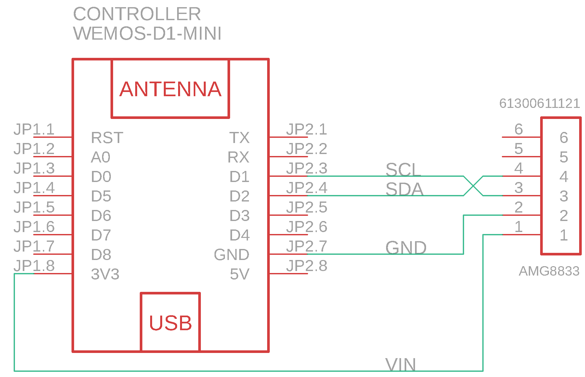

# ESPHome AMG8833

Source code for creating firmware for an ESP8266 chip (d1 mini in my case) to use an AMG8833 sensor with [Thermal Vision](https://github.com/TheRealWaldo/thermal) via. [ESPHome](https://esphome.io).

Prefer to use [PlatformIO](https://platformio.org/)?  See [TheRealWaldo/esp8266-amg8833](https://github.com/TheRealWaldo/esp8266-amg8833).

## Parts

[AMG8833](https://industry.panasonic.eu/components/sensors/industrial-sensors/grid-eye/amg88xx-high-performance-type/amg8833-amg8833) - I used one on a breakout board for quick prototyping from [AliExpress](https://www.aliexpress.com/item/1005001585288156.html?spm=a2g0s.9042311.0.0.27424c4dmuBfsJ).

[D1 Mini](https://www.wemos.cc/en/latest/d1/d1_mini.html) - There is quite a few variants of this, but I had some laying around from [Banggood](https://www.banggood.com/Geekcreit-D1-Mini-V3_0_0-WIFI-Internet-Of-Things-Development-Board-Based-ESP8266-4MB-MicroPython-Nodemcu-p-1264245.html?cur_warehouse=CN&ID=522225).

## Wiring



## Building

This project uses [ESPHome](https://esphome.io).  You'll need to provide your own `secrets.yaml` in the root directory, providing `ssid`, `password`, and `domain` if you wish to use the [amg8833.yaml](amg8833.yaml) example configuration.

```bash
pip3 install esphome
esphome amg8833.yaml run
```

## Configuring

The [Thermal Vision](https://github.com/TheRealWaldo/thermal) camera can be configured by providing the [AMG8833CameraComponent](amg8833_camera.h)'s resulting sensor in HASS to the configuration option `pixel_sensor` instead of `host`.

### Example:
```yaml
  - platform: thermal_vision
    name: Prototype Thermal Camera
    overlay: true
    pixel_sensor: sensor.sensor_pixels
    auto_range: true
```

It's important to note that only the Camera sensor will work in this manner.  The other sensors are provided natively via. [ESPHome](https://esphome.io) and [amg8833.h](amg8833.h).

Also important to note; the pixel sensor is _very_, _very_ noisy!  You will probably want to exclude it from your HA history.

### Example:
```yaml
history:
  exclude:
    entities:
      - sensor.sensor_pixels
```
